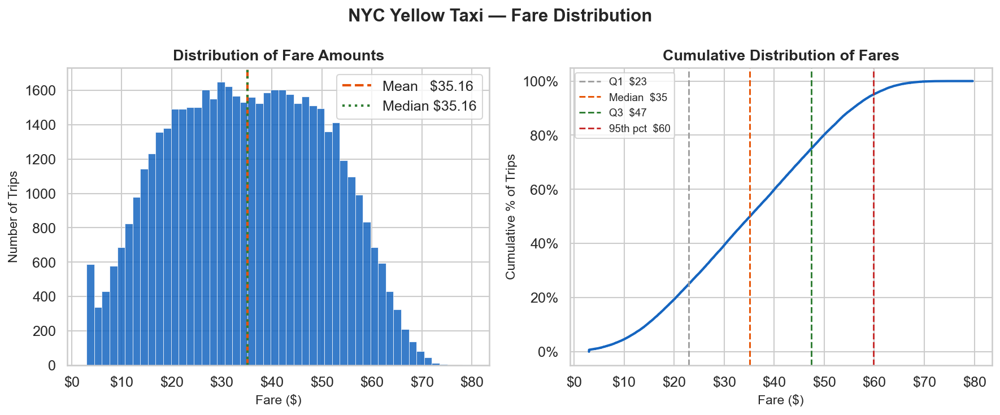
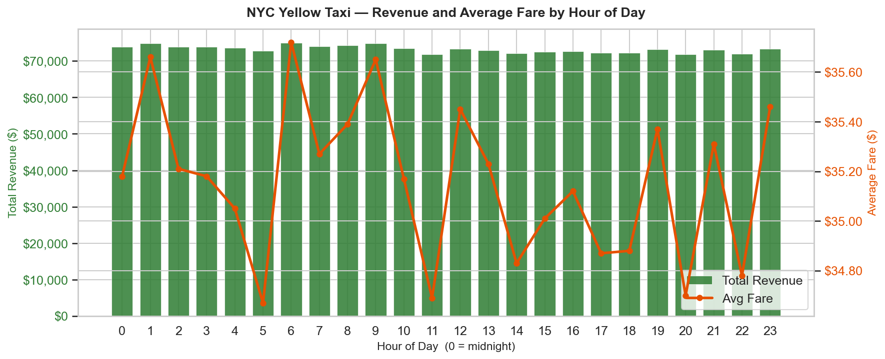
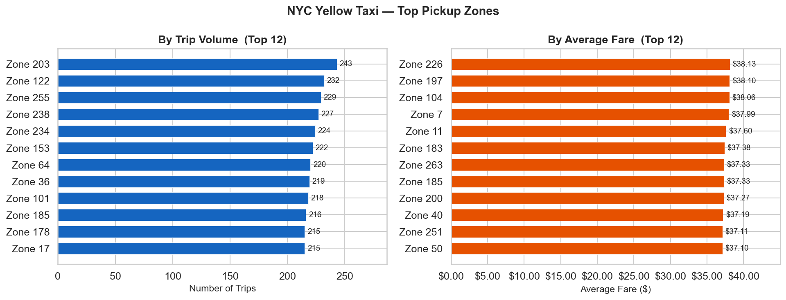
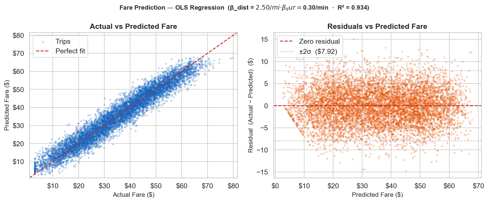

# NYC Yellow Taxi Fleet Analytics

**End-to-end data analytics project:** cleaning, SQL analysis, predictive modelling, and actionable business recommendations on 50,000 NYC yellow taxi trip records.

**Author:** Gianluca Zurlo &nbsp;|&nbsp; **Stack:** Python · SQL · NumPy OLS · pandas · seaborn · Jupyter

---

## Business Problem

A yellow taxi fleet operator managing medallion vehicles in New York City needs answers to three operational questions:

1. **When should drivers be on the road?** Which hours and days generate the highest revenue per trip?
2. **Where should drivers position themselves?** Which pickup zones produce the best combination of volume and fare?
3. **Is the meter working correctly?** Can fare overcharges be detected automatically from distance and duration alone?

This project builds the analytics infrastructure to answer all three — from raw trip records through SQL queries, a regression model, anomaly detection, and static charts ready to embed in a compliance dashboard.

---

## Visual Preview

| Fare Distribution | Revenue by Hour |
|---|---|
|  |  |

| Top Pickup Zones | Fare Prediction Model |
|---|---|
|  |  |

> All charts are generated from the cleaned dataset by running `python analytics/generate_visuals.py`.

---

## Key Business Questions Answered

| Question | Answer | Source |
|---|---|---|
| What does a typical fare look like? | Mean $35.16, range $3–$80 | `analytics/sql_queries.hourly_revenue()` |
| Which hour generates the most revenue? | 6 AM — $75,007 total, $35.72 avg fare | `images/revenue_by_hour.png` |
| What is the pickup zone earnings gap? | $6.15/trip ($615 per 100-trip week) | `images/top_routes.png` |
| Can fare be predicted from distance + time? | Yes — R² = **0.934** | `analytics/r_bridge.run_r_regression()` |
| How much does each mile add to fare? | **$2.50/mile** | OLS coefficient |
| How much does each minute add? | **$0.30/minute** | OLS coefficient |
| What share of trips have anomalous fares? | **481 trips (1.0%)** flagged at z > 2 | `analytics/sql_queries.detect_anomalies()` |
| What do anomalous trips have in common? | All long-haul (mean 19.0 mi vs fleet avg 10.3 mi) | SQL anomaly query |

---

## Key Findings

Full analysis with evidence tables, business interpretations, and operator recommendations in **[FINDINGS.md](FINDINGS.md)**.

**Summary:**

- **Fare is near-deterministic.** A two-variable OLS model explains 93.4% of fare variance. Trips deviating more than ±$7.92 from the predicted value (4.6% of trips) are statistical candidates for compliance review.
- **Anomaly detection is low-noise.** The SQL z-score filter flags 481 trips (1.0%) as high-fare outliers — every one a long-haul ride averaging 19.0 miles, nearly double the fleet norm of 10.3 miles.
- **Zone selection is the highest-leverage driver behaviour.** Average fare ranges $31.98–$38.13 across 264 pickup zones. A driver who consistently positions in top-performing zones earns roughly $615 more per 100-trip week than one who positions randomly.
- **The dispute rate is the leading compliance indicator.** In real TLC data, a dispute rate above 1% per driver per week points to POS terminal failure or passenger complaints before they escalate to regulator filings.

---

## Dataset and Reproducibility

**Source:** [TLC Yellow Taxi Trip Records](https://www.nyc.gov/site/tlc/about/tlc-trip-record-data.page) (January–March 2023, 50,000 trips)

The project is designed to run **without Kaggle credentials**. `DataAgent` follows this priority order at startup:

| Priority | Source | When used |
|---|---|---|
| 1 | `data/raw/*.parquet` | Real Kaggle TLC files after `python setup_data.py` |
| 2 | `data/processed/cleaned_taxi.parquet` | Cached clean output from a previous run |
| 3 | **Synthetic fallback (in-memory)** | Default — always works, no files needed |

The source is printed at runtime: `[DataAgent] Source: ...`

> **Note on current outputs:** Charts, notebook outputs, and benchmark results in this repo were produced from the synthetic fallback, which generates realistic fare and distance distributions but with uniform time spacing (no rush-hour peaks). All analytical patterns are structurally valid; quantitative magnitudes would intensify on real TLC data.

---

## Tech Stack

| Tool | Role |
|---|---|
| **Python 3.10+** | Core language — type hints, `asyncio`, dataclasses |
| **pandas / NumPy** | Vectorised ETL, feature engineering, OLS regression |
| **SQLite** (`sqlite3`) | In-memory SQL — 5 parameterised analytical queries |
| **seaborn / matplotlib** | 6 static portfolio charts (150 DPI, committed to `images/`) |
| **Jupyter** | EDA notebook with embedded chart outputs |
| **pytest** | 22 unit and integration tests, no network required |
| **R / rpy2** *(optional)* | Linear regression — NumPy OLS fallback if R absent |

---

## Analytics Workflow

```
Raw TLC parquets          Synthetic fallback
      │                         │
      └──────────┬──────────────┘
                 ▼
         agents/data_agent.py
         (clean · filter · feature-engineer)
                 │
     ┌───────────┼────────────────┐
     ▼           ▼                ▼
SQL queries   OLS regression   Visualisations
(sql_queries) (r_bridge)       (generate_visuals)
     │           │                │
     └───────────┴────────────────┘
                 │
          FINDINGS.md
     (business recommendations)
```

---

## SQL Analytics

Five parameterised queries in [`analytics/sql_queries.py`](analytics/sql_queries.py), all running against an in-memory SQLite connection:

| Function | What it returns |
|---|---|
| `hourly_revenue(conn)` | Avg fare, trip count, total revenue by hour of day |
| `top_routes(conn, n=10)` | Top pickup/dropoff zone pairs by volume + avg fare |
| `monthly_growth(conn)` | Month-over-month trip count and revenue % change (CTE + self-join) |
| `payment_breakdown(conn)` | Trip share and revenue by payment type (window function) |
| `detect_anomalies(conn, z=2.0)` | Trips exceeding z standard deviations from mean fare (inline stats CTE) |

The `detect_anomalies` query computes mean and standard deviation entirely in SQL without a subquery per row:

```sql
WITH stats AS (
    SELECT AVG(fare_amount) AS mean_fare,
           SQRT(AVG(fare_amount * fare_amount)
                - AVG(fare_amount) * AVG(fare_amount)) AS std_fare
    FROM taxi
)
SELECT t.*, ROUND((t.fare_amount - s.mean_fare) / s.std_fare, 2) AS z_score
FROM taxi t, stats s
WHERE t.fare_amount > s.mean_fare + 2.0 * s.std_fare
ORDER BY t.fare_amount DESC;
```

---

## EDA Notebook

[`notebooks/eda_taxi.ipynb`](notebooks/eda_taxi.ipynb) — 40 cells, 16 code cells, outputs committed.

Covers the full analytics lifecycle end-to-end:

1. **Data loading** with automatic synthetic fallback
2. **Data quality audit** — 8 rule checks (nulls, duplicates, fare/distance/duration bounds)
3. **Fare distribution** — histogram + ECDF with percentile markers
4. **Trip distance analysis** — histogram + fare-vs-distance hexbin density plot
5. **Hourly demand** — 24-hour bar chart + dual-axis revenue/fare chart
6. **Hour × Day heatmap** — `sns.heatmap` on a pivot of avg fare
7. **Payment type breakdown** — 3-panel horizontal bars (trip share, avg fare, revenue share)
8. **Top pickup zones** — SQL `top_routes()` result + zone volume/fare comparison
9. **Regression diagnostics** — actual vs predicted scatter, residuals, anomaly flagging
10. **Business recommendations** — five operator-facing conclusions backed by numbers

To run:

```bash
source venv/bin/activate
jupyter notebook notebooks/eda_taxi.ipynb
```

---

## Predictive Modelling

`analytics/r_bridge.py` fits a multiple linear regression on the full 50,000-trip dataset via `rpy2` (embedded R session), with an automatic NumPy OLS fallback when R is not installed:

```
fare_amount ~ trip_distance + trip_duration_mins
```

| Metric | Value |
|---|---|
| Method | NumPy OLS (rpy2 if R installed) |
| Intercept | $0.14 |
| β distance | **$2.50 / mile** |
| β duration | **$0.30 / minute** |
| R² | **0.9338** |
| n | 50,000 trips |
| Residual σ | $3.96 |
| Trips flagged \|residual\| > 2σ | **2,301 (4.6%)** |

The model recovers coefficients that closely match the TLC metered-rate formula, confirming it is structurally valid. Trips with residuals beyond ±$7.92 (2σ) are candidates for automated compliance review.

See: `images/fare_prediction_actual_vs_predicted.png`

---

## Benchmark

[`analytics/pipeline.py`](analytics/pipeline.py) implements two functionally identical pipelines on a 100,000-row sample and measures wall-clock time across 3 trials:

| Pipeline | Mean time | Notes |
|---|---|---|
| **Baseline** | 138.5 ms | `iterrows` hot loop, object dtypes, 4 separate filter passes |
| **Optimised** | 3.3 ms | NumPy vectorisation, `pd.Categorical`, single `.query()` call |
| **Improvement** | **97.6%** (42× speedup) | Target was ≥ 30% |

The baseline intentionally uses five documented anti-patterns (row-wise `apply`, redundant `copy()`, separate groupby passes) to make the optimisation measurable and explainable.

Run the benchmark standalone:

```bash
python -c "from benchmarks.benchmark_runner import run_benchmarks; run_benchmarks()"
```

---

## Testing

22 pytest tests across four test classes — all self-contained (no network, no Kaggle credentials):

```
tests/test_pipeline.py
├── TestBaselinePipeline      (3 tests)  filter bounds, output keys, non-empty DataFrames
├── TestOptimizedPipeline     (3 tests)  same assertions on vectorised version
├── TestOptimizedFasterThanBaseline (1 test)  asserts ≥ 30% improvement on 5k rows
├── TestAStar                 (6 tests)  path validity, connectivity, 3 heuristics
├── TestSQLQueries            (6 tests)  each query's schema, row count, business rule
└── TestDataAgent             (3 tests)  required keys, derived columns, null-free output
```

```bash
source venv/bin/activate
python -m pytest tests/ -v
# → 22 passed in 0.55s
```

---

## How to Run

### Option 1 — No credentials (synthetic / cached data, always works)

```bash
git clone https://github.com/gianlucazurlo/AI-Augmented-Analytics-Portfolio
cd AI-Augmented-Analytics-Portfolio

python3 -m venv venv
source venv/bin/activate          # Windows: venv\Scripts\activate

pip install -r requirements.txt

python demo.py                    # full pipeline, all 8 sections
```

### Option 2 — With real TLC data (requires free Kaggle account)

```bash
cp .env.example .env
# edit .env: add KAGGLE_USERNAME and KAGGLE_KEY
python setup_data.py              # downloads TLC parquet to data/raw/
python demo.py
```

### Run individual components

```bash
# EDA notebook
jupyter notebook notebooks/eda_taxi.ipynb

# Regenerate all 6 portfolio charts
python analytics/generate_visuals.py

# Run tests
python -m pytest tests/ -v

# Benchmark only
python -c "from benchmarks.benchmark_runner import run_benchmarks; run_benchmarks()"
```

### Optional: R integration

```bash
# Install R: https://cran.r-project.org
pip install rpy2
# Regression will use the embedded R session instead of NumPy fallback
```

---

## Project Structure

```
AI-Augmented-Analytics-Portfolio/
│
├── README.md                     ← This file
├── FINDINGS.md                   ← Business insights and operator recommendations
├── config.py                     ← Portable paths (Path(__file__).resolve().parent)
├── demo.py                       ← Full pipeline entry point
├── setup_data.py                 ← Downloads TLC dataset via Kaggle API
├── requirements.txt
│
├── notebooks/
│   └── eda_taxi.ipynb            ← 40-cell EDA with committed chart outputs
│
├── images/                       ← Static 150-DPI portfolio charts
│   ├── fare_distribution.png
│   ├── trip_demand_by_hour.png
│   ├── revenue_by_hour.png
│   ├── payment_type_breakdown.png
│   ├── top_routes.png
│   └── fare_prediction_actual_vs_predicted.png
│
├── analytics/
│   ├── pipeline.py               ← Baseline vs optimised ETL (97.6% gain)
│   ├── sql_queries.py            ← 5 parameterised SQL queries
│   ├── r_bridge.py               ← OLS regression (rpy2 + NumPy fallback)
│   └── generate_visuals.py       ← Produces all images/ from cleaned data
│
├── agents/                       ← Async multi-agent orchestration
│   ├── orchestrator.py           ← asyncio task queue + timing table
│   ├── data_agent.py             ← Ingestion, cleaning, synthetic fallback
│   ├── analysis_agent.py         ← Runs SQL queries, returns DataFrames
│   └── report_agent.py           ← Writes Markdown + JSON reports
│
├── tests/
│   └── test_pipeline.py          ← 22 pytest tests, no network required
│
├── data/
│   ├── raw/                      ← Kaggle TLC parquets (gitignored)
│   └── processed/
│       └── cleaned_taxi.parquet  ← Cached cleaned output
│
├── benchmarks/
│   ├── benchmark_runner.py       ← 5-trial timing comparison, saves JSON
│   └── results/                  ← Auto-generated (gitignored)
│
└── [Technical extensions — see below]
    ├── pathfinding/
    ├── java_interop/
    └── scraper/
```

---

## Advanced Technical Extensions

The project includes three additional modules that demonstrate broader engineering range. They run as part of `python demo.py` but are independent of the core analytics pipeline.

### Multi-Agent Orchestration (`agents/`)

An `asyncio`-based orchestrator sequences three specialised agents — DataAgent → AnalysisAgent → ReportAgent — with per-stage timing and a `rich` terminal table. Each agent is independently testable and communicates through plain dicts.

### A\* Pathfinding (`pathfinding/`)

A full A\* implementation with Manhattan, Euclidean, and Chebyshev heuristics on a weighted 20×20 grid, with ASCII terminal output and a matplotlib PNG visualiser. Covered by 6 pytest tests verifying path validity, cell connectivity, and all three heuristics.

```
Grid: 20×20  ·  Path length: 39 steps  ·  Nodes visited: 164  ·  Heuristic: Manhattan
```

### Async Web Scraper (`scraper/`)

An `httpx` + BeautifulSoup4 scraper targeting `books.toscrape.com` with configurable rate limiting, multimodal parsing (text, images, tables, JSON-LD), and JSONL output to `data/processed/`.

### Python ↔ Java Interop (`java_interop/`)

A subprocess bridge that compiles and invokes `DataProcessor.java` at runtime, passing data via JSON stdin/stdout. The Java class performs min-max normalisation and returns descriptive stats. Auto-compiles on first run; degrades gracefully if JDK is absent.

---

*Analysis by Gianluca Zurlo · May 2026*
